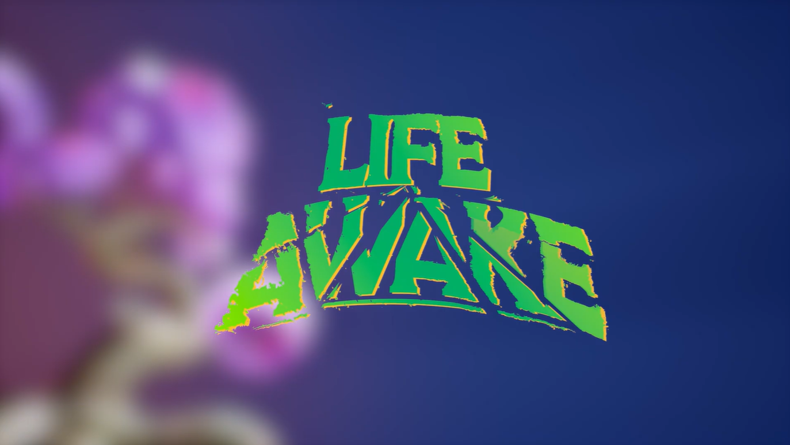
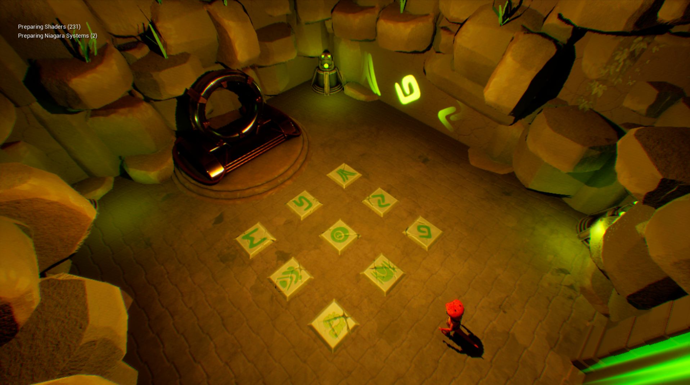

# 🦎 **Life Awake**
**A 3D puzzle-adventure game built with Unreal Engine 5**

---

## 📜 **Project Description**

**Life Awake** follows a small gecko on a journey to restore the beauty of **Isumera**, the great tree whose roots once connected every world.

To succeed, the gecko must travel through the portals scattered along its path, crossing a variety of environments and facing trials and puzzles unique to each one. With every trial overcome, Isumera grows a little closer to the splendor it once had.

This is a **student project** developed over the course of a school year by a team of **9 students** at **Ynov Lyon**, totaling around **77 hours** of work.

---

## 🚪 **Main Features**

### 🔹 **Portal Traversal**
- Travel between distinct worlds through interactive portals
- Each world introduces new puzzles and challenges

### 🔹 **Puzzle & Trial Systems**
- **Slabs**: pressure-plate sequence puzzles with error/reset feedback
- **Valves**: rotating mechanical interactions
- **Light Reflection**: pillar-based light puzzles
- **Telescope**: sky-gazing mechanic to reveal clues

### 🔹 **Exploration & Progression**
- **Clue papers** to collect and read for hints and lore
- **Chests & keys** to unlock new areas
- **Inventory system** to track collected items
- The **Isumera tree** visibly grows across levels as puzzles are solved

### 🔹 **Camera & Controls**
- Dynamic third-person camera with obstacle-aware distance adjustment
- Full **keyboard & mouse** support
- **Gamepad/controller** support

---

## 🚀 **Installation**

### **Play the game**
A build of Life Awake is available on itch.io:
👉 [life-awake.itch.io](https://life-awake.itch.io/life-awake) <!-- TODO: replace with the real itch.io link -->

---

## 🛠️ **Technologies Used**
- **Engine**: Unreal Engine 5.6
- **Scripting**: Blueprints
- **Platform**: Windows

---

## 🧑‍💻 **Team**

Developed as part of a learning project at **Ynov Lyon**.

| Role | Name |
|---|---|
| 3D Artist / Animator / Project manager | Gaspard Ribeyre |
| 3D Artist / Animator / Project manager | Rafael Calabrese |
| Gameplay Programmer | Hugo Flandrin |
| Gameplay Programmer | Omar Yassine |
| Creative Direction / Game Design | Emmanuel Kouassi |
| 3D Artist / Animator | Pierre Yvart |
| 3D Artist / Animator | Ilhem Guelai |
| 3D Artist / Animator | Nathan Seabra-Gibernon |
| 3D Artist / Animator | Rémi Caffy |
